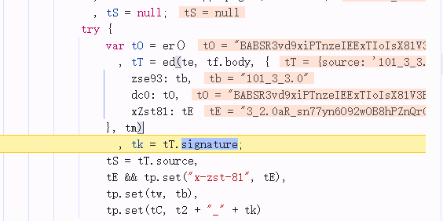
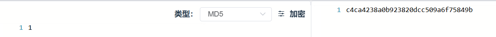
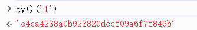
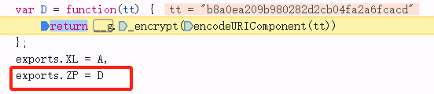
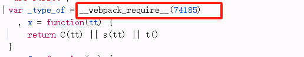
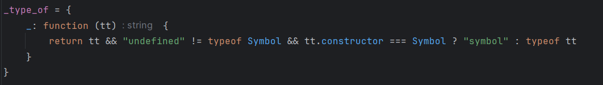

## 前言
该文章为学习使用，严禁用于商业用途和非法用途，否则由此产生的一切后果均与作者无关！如有侵权，请私信联系作者删除~

很久没写博客了，今天玩一下某乎的x-zse-96参数，不知道跟去年的有没有变化

## 正文

找到这个位置



tT里的signature就是x96的值,ed就是生成函数，理顺参数的值

```javascript
// url
te = "/api/v3/feed/topstory/recommend?action=down&ad_interval=-10&after_id=53&desktop=true&end_offset=62&page_number=10&session_token=a6876b8cfab17a33b100701341c526a3"
tf.body = undefined
// 固定
tb = "101_3_3.0"
// 生成t0的函数
tO = er()
t0 = "BABSR3vd9xiPTnzeIEExTIoIsX81V3BAbyw=|1721730809"
// 先固定
tE = "3_2.0aR_sn77yn6O92wOB8hPZnQr0EMYxc4f18wNBUgpTQ6nxERFZB0Y0-4Lm-h3_tufIwJS8gcxTgJS_AuPZNcXCTwxI78YxEM20s4PGDwN8gGcYAupMWufIeQuK7AFpS6O1vukyQ_R0rRnsyukMGvxBEqeCiRnxEL2ZZrxmDucmqhPXnXFMTAoTF6RhRuLPF8LLDuc9Cbo1HqtOhUHKNwxKTgxY2q38phF8JwV9rHLCo7VVZqLY6gcqUGeTvAOfSQS8ubO13JUGgDSKoTLGJUOKkULq0hXL3Dg_5UNG6h3M_JH_XUYCzbeMWbpLPvH_0CYmW9cV6gN1PDH9o6NKMMwCeHgCu93pUCS81_OfjvO_HqpmOqfz1eeqkD99JcNxOqVCGXgqwcVmauYp09F919w1Hrp0DrNO8wofYhH_S4SYqgSBjvH9ZhLfjG__YBt8DUxfQwFqQUL88UCOqGcfm_F8nwLCNvX_ChXC-rOC"
tT = ed(te, tf.body, {
    zse93: tb,
    dc0: tO,
    xZst81: tE
}, tm)
```
先看er这个函数
```javascript
t9 = RegExp("d_c0=([^;]+)")
    //这个正则表达式匹配 d_c0= 后面跟着的 非分号字符（[^;]+）。
    // ([^;]+) 是一个 捕获组，表示匹配 d_c0= 之后的所有字符，直到遇到分号 ;（Cookie 的分隔符）或字符串结束。
    , er = function() {
        var tt = t9.exec(document.cookie); // 在 document.cookie 中匹配正则
        return tt && tt[1] // 如果匹配成功，返回捕获组（即 d_c0 的值）
        }
        
```
接下来重点看ed这个函数就可以了
```javascript
function ed(tt, te, tr, ti) {
            var ta = tr.zse93
              , tu = tr.dc0
              , tc = tr.xZst81
              , tf = t3(tt) // 最终返回的是 路径 + 查询参数
              , td = t6(te) // 转换字符串""
              , tp = [ta, tf, tu, t8(td) && td, tc].filter(Boolean).join("+"); //过滤数组中的假值（falsy values），并用 + 连接剩余的值。
            return {
                source: tp,
                signature: (0,
                tJ(ti).encrypt)(ty()(tp))
            }
        }
```

可以看到signature的生成位置，需要分析**ty()(tp)**和**tJ(ti).encrypt**

ty()(tp)  这个函数实际上是一个标准的MD5加密，测试一下就可以了，不展开讲



可以看到已经把方法D给导出来了，因此，我们把这个模块复制下来本地


这里会报一个错，把方法补一下进去



然后hook随机数，扣下来的代码放到浏览器上验证结果是否正确
```javascript
Math.random = function(){
    return 0.50
};
```
接下来就是在本地补环境了

#### 代理环境
```javascript
function getEnv(proxy_array) {
    for (let i = 0; i < proxy_array.length; i++) {
        handler = `{
            get: function(target, property, receiver) {
                   console.log('方法：get','    对象：${proxy_array[i]}','    属性：',property,'    属性类型：',typeof property,'    属性值类型：',typeof target[property]);
                   return target[property];
            },
            set: function(target, property, value, receiver){
                    console.log('方法：set','    对象：${proxy_array[i]}','    属性：',property,'    属性类型：',typeof property,'    属性值类型：',typeof target[property]);
                    return Reflect.set(...arguments);
            }
        }`;
        eval(`
            try {
                ${proxy_array[i]};
                ${proxy_array[i]} = new Proxy(${proxy_array[i]}, ${handler});
            } catch (e) {
                ${proxy_array[i]} = {};
                ${proxy_array[i]} = new Proxy(${proxy_array[i]}, ${handler});
            }
        `);
    }
}
proxy_array = ['window', 'document', 'location', 'navigator', 'history', 'screen', 'self']
getEnv(proxy_array);
```

### 环境代码
```javascript
window = globalThis;
delete global
window.name = ''
window.__ZH__ = {
    "zse": {
        "zk": [
            1170614578,
            1024848638,
            1413669199,
            -343334464,
            -766094290,
            -1373058082,
            -143119608,
            -297228157,
            1933479194,
            -971186181,
            -406453910,
            460404854,
            -547427574,
            -1891326262,
            -1679095901,
            2119585428,
            -2029270069,
            2035090028,
            -1521520070,
            -5587175,
            -77751101,
            -2094365853,
            -1243052806,
            1579901135,
            1321810770,
            456816404,
            -1391643889,
            -229302305,
            330002838,
            -788960546,
            363569021,
            -1947871109
        ],
        "zb": [
            20,
            223,
            245,
            7,
            248,
            2,
            194,
            209,
            87,
            6,
            227,
            253,
            240,
            128,
            222,
            91,
            237,
            9,
            125,
            157,
            230,
            93,
            252,
            205,
            90,
            79,
            144,
            199,
            159,
            197,
            186,
            167,
            39,
            37,
            156,
            198,
            38,
            42,
            43,
            168,
            217,
            153,
            15,
            103,
            80,
            189,
            71,
            191,
            97,
            84,
            247,
            95,
            36,
            69,
            14,
            35,
            12,
            171,
            28,
            114,
            178,
            148,
            86,
            182,
            32,
            83,
            158,
            109,
            22,
            255,
            94,
            238,
            151,
            85,
            77,
            124,
            254,
            18,
            4,
            26,
            123,
            176,
            232,
            193,
            131,
            172,
            143,
            142,
            150,
            30,
            10,
            146,
            162,
            62,
            224,
            218,
            196,
            229,
            1,
            192,
            213,
            27,
            110,
            56,
            231,
            180,
            138,
            107,
            242,
            187,
            54,
            120,
            19,
            44,
            117,
            228,
            215,
            203,
            53,
            239,
            251,
            127,
            81,
            11,
            133,
            96,
            204,
            132,
            41,
            115,
            73,
            55,
            249,
            147,
            102,
            48,
            122,
            145,
            106,
            118,
            74,
            190,
            29,
            16,
            174,
            5,
            177,
            129,
            63,
            113,
            99,
            31,
            161,
            76,
            246,
            34,
            211,
            13,
            60,
            68,
            207,
            160,
            65,
            111,
            82,
            165,
            67,
            169,
            225,
            57,
            112,
            244,
            155,
            51,
            236,
            200,
            233,
            58,
            61,
            47,
            100,
            137,
            185,
            64,
            17,
            70,
            234,
            163,
            219,
            108,
            170,
            166,
            59,
            149,
            52,
            105,
            24,
            212,
            78,
            173,
            45,
            0,
            116,
            226,
            119,
            136,
            206,
            135,
            175,
            195,
            25,
            92,
            121,
            208,
            126,
            139,
            3,
            75,
            141,
            21,
            130,
            98,
            241,
            40,
            154,
            66,
            184,
            49,
            181,
            46,
            243,
            88,
            101,
            183,
            8,
            23,
            72,
            188,
            104,
            179,
            210,
            134,
            250,
            201,
            164,
            89,
            216,
            202,
            220,
            50,
            221,
            152,
            140,
            33,
            235,
            214
        ],
        "zm": [
            120,
            50,
            98,
            101,
            99,
            98,
            119,
            100,
            103,
            107,
            99,
            119,
            97,
            99,
            110,
            111
        ]
    }
}
location = {}
navigator = {
    userAgent: 'Mozilla/5.0 (Windows NT 10.0; Win64; x64) AppleWebKit/537.36 (KHTML, like Gecko) Chrome/133.0.0.0 Safari/537.36',
}
history = {}
screen = {}
history = {}
class HTMLElement {
    constructor(tagName) {
        this.tagName = tagName.toUpperCase();
        this.id = "";
        this.className = "";
        this.attributes = {};
        this.children = [];
        this.parentNode = null;
    }

    get [Symbol.toStringTag]() {
        return `HTML${this.tagName.charAt(0) + this.tagName.slice(1).toLowerCase()}Element`;
    }
}
document = {
    _elements: {},
    getElementById(id) {
        return this._elements[id] || null;
    },
    setAttribute(name, value) {
        this.attributes[name] = value;
        if (name === "id") {
            this.id = value;
            document._elements[value] = this; // 注册到 document
        } else if (name === "class") {
            this.className = value;
        }
    },
    createElement(tagName) {
        if (tagName === 'canvas') {
            return new Canvas(tagName);
        }
    },
    getElementsByClassName() {
        return {}
    },
}
alert = function alert() {
}
Object.defineProperty(document, Symbol.toStringTag, {
    value: "HTMLDocument",
    enumerable: false, // 使其不可枚举（与浏览器行为一致）
    configurable: true,
    writable: false,
});
Object.defineProperty(navigator, Symbol.toStringTag, {
    value: "Navigator",
    enumerable: false, // 使其不可枚举
    configurable: true,
    writable: false,
});
Object.defineProperty(location, Symbol.toStringTag, {
    value: "Location",
    enumerable: false, // 使其不可枚举
    configurable: true,
    writable: false,
});
Object.defineProperty(location, "href", {
    value: 'https://www.zhihu.com/',
    enumerable: true,
    writable: true,
});
Object.defineProperty(location, "toString", {
    value: function () {
        return this.href; // 返回 href
    },
    enumerable: false, // 与浏览器一致，toString 不可枚举
});
Object.defineProperty(history, Symbol.toStringTag, {
    value: "History",
    enumerable: false,
});
Object.defineProperty(screen, Symbol.toStringTag, {
    value: "Screen",
    enumerable: false,
});

class CanvasRenderingContext2D {
    [Symbol.toStringTag] = "CanvasRenderingContext2D";
}

class Canvas extends HTMLElement {
    constructor() {
        super("canvas");
    }

    getContext() {
        if (arguments[0] === "2d") {
            return new CanvasRenderingContext2D()
        }
        console.log('canvas', arguments)
    }

    [Symbol.toStringTag] = "HTMLCanvasElement";
}

```

### 最后
**欢迎联系作者交流更多**